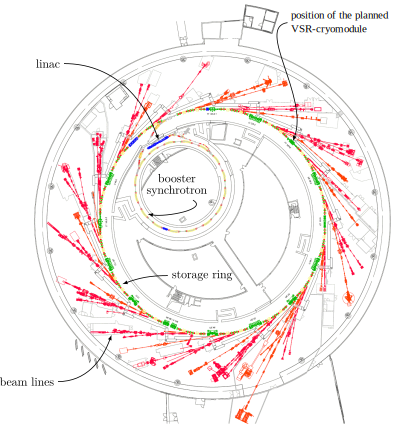

<!-- ## old stuff

- Simulation tool to optimize the BESSY II optics with regard to the VSR Optics was developed in the Bachelors thesis. This tool was improved significantly and was used to further optimize the best solution of the BA. This tool can also be used for other LatticeDesign related tasks:

- Beam Physics of lightsource lattices (auch MBA): Comparing the most important lattices & parameters (emittance, Einheitszelle Twiss(betax/y, dispx)) of a few exemplary lattices
- The goal is to use this tool to develop a lattice of the BESSY II successor in the phd

- The goal of this thesis was to further enhance this tool. Discuss its capabitlites at the example of canonical lattices FODO, DBA, TBA. Its application for real world use cases is descirbed in  ...
- Fuer die optimierung von BESSY II lattice und fuer die entwicklung von BESSY3 lattice wird ein lattice development tool gebraucht! Da alle Python nutzen, waere es wuenschenswert, wenn diese ein native Python anbindung hat! -->

<!-- - Complex filling pattern and low alpha -> VSR and using TRIBs to separate bunches
- vsr module benotiegt mehr platz. BA hat eine loesung fuer gefunden. diese optics muss wieter verbessert werden.

- Q5t2 und andre lattice modifications brauchen ein optimierungs program fuer twiss. warum eine neue software geschrieben wude anstatt exisiterende zu nutzen is in motivations erklaert.
- ein Python API/Wrapper fuer die complexen C programme elegant und MADX zu schreiben, scheint schwieriger zu sein, als ein simpleren optics optimierer in python von scrztch zu schreiben. fuer lattice design erstmal nur twiss, tune, emittance synch integrals wichtig. --->

# Introduction

This thesis presents the development of a new lattice design tool and how it was used for lattice ... . The first section of this chapter gives a brief overview of the third generation light source BESSY II. The second section covers the current lattice design task at HZB. The challenges of integrating existing simulation codes in a modern and high-level programming language are discussed in the third section and are the motivation for the development of the new lattice design tool.

## BESSY II - A Third Generation Light Source

The third generation synchrotron light source BESSY II is located in Berlin Adlershof and is operated by the research institute HZB since 1998. Its purpose is to provide extremely brilliant synchrotron light pulses in the range from long terahertz radiation to hard X-rays. The storage ring has a circumference of 240 m and is equipped with 50 beam-lines. A graphic overview of BESSY II is shown in [@fig:bessy2-floorplan]. The most important parameters of the storage ring are listed in [@tbl:bessy2-parameters].

{#fig:bessy2-floorplan}

| Parameter                 | Value   |
| ------------------------- | ------- |
| nominal energy            | 1.7 GeV |
| circumference             | 240 m   |
| RF-frequency              | 500 MHz |
| revolution time           | 800 ns  |
| beam current              | 300 mA  |
| number of cells           | 16      |
| number of bending magnets | 32      |
| bending radius            | 4.361 m |
| beam-lines                | ≈50     |
: Parameters of the BESSY II storage ring {#tbl:bessy2-parameters}

The electrons are emitted by a DC grid cathode and are accelerated up to 90 keV. In the following linac their energy is increased up to 50 MeV [@linac]. Next the electrons are transferred to the booster synchrotron, where they are accelerated up to 1.7 GeV and are than injected to the storage ring cumulatively, so that a beam current of 300 mA is maintained (*top-up*). The electrons can be saved for up to 10 hours and emit, depending on the type of deflection (bending magnet, wiggler or undulator), photon energies up to 15 keV.

At BESSY II it is possible to operate the machine in two different modes. Most of the time the storage ring is set to the standard user optics with 15 ps bunch length. During two weeks of the year the lattice is changed to the low alpha optics, which provide buckets with 3 ps bunch length [@vsrstudy]. This can be realized by reducing the momentum compaction factor $\alpha_{\mathrm{c}}$ from  $7 \cdot 10^{-4}$ to $4 \cdot 10^{-5}$. The coherent synchrotron radiation instability leads to a limiting bursting threshold current, which scales with~$\alpha_{\mathrm{c}}$. Therefore the photon flux has to be reduced significantly in comparison to the standard optics. In this time high flux user are not able to run experiments, which is the reason that the low alpha mode can only be provided for short periods.

## Lattice Development at HZB

At HZB there a several lattice development tasks which require convenient and interactive tools.

### Enlarging the Available Installation Length for VSR Cryomodule

AT the HZB superconducting cavities are developed for the generation of long and short electron bunches. A cavity module, consisting of two 1.5 GHz and 1.75 GHz cavities each, can be assembled into a straight of the BESSY II storage ring, if the space for the module can be enlarged by modifying the beam optics. One possible solution is to remove two quadrupoles to gain the required installation length. With a self-developed code the two quadruples were turned off in simulations and the obtained optics was transferred to the storage ring. To avoid coupled bunch instabilities low beta functions within the VSR-module are required.

![Voltage of the VSR cavities and their sum. The alternating large (blue) and small (red) gradients lead to short and longer bunches, respectively. (based on [@vsrstudy] and [@rubprecht-phd])](figures/vsr-cavity-voltage.svg){#fig:vsr-cavity-voltage}

{#fig:vsr-installation-length}

### Adapting the Beta Functions of the BESSY II Storage Ring

For certian experiments smaller adjustments of the beta functions are needed. In the case of an emittance exchange erxperiment ...

<!-- Picture of beta function in straight -->

### Development of the BESSY III Lattice

- Viel los in der Welt: MBA lattices worldwide as updates for lowest emittance, but no timing: https://www.maxiv.lu.se/science/accelerator-physics/current-projects/timing-modes-for-the-max-iv-storage-rings/

## Motivation: The Need for a Python Interface to Particle Accelerator Simulations

MAD-X [@madx] and elegant [@elegant] are the most mature and commonly used accelerator physics simulation codes. Both programs a driven by an input file - often called run-file. This file defines various simulation parameters, but can also be used to define an optimization procedure. After the execution the results are stored in an output file. Over the years there emerged various tool-kits and programs to inspect, post-process and plot these results. Sometimes, for complex runs more flexibility is needed, which is the reason Python is commonly used for post-processing and analysis of the simulation data.

Python has a rich ecosystem of numerical libraries and optimization tools, which is growing day by day. It has become the go-to language for scientific computing and machine learning. A typical workflow of using MAD-X or elegant with Python would be (see @fig:workflow-analysis-python):

1. Create a run file
2. Run the simulation defined by the run-file
3. Store the results as file.
4. Load the simulation results into Python and post-process the data.
5. Output the post-processed data. (e.g. a plot or a new optics file)

{#fig:workflow-analysis-python}

One issue of this workflow is that not all information contained within the data-structures and models of the simulation software is included in the output files. For example MAD-X and elegant do not include complete model of the accelerator's lattice, but only an arrays of elements for the simulated orbit positions. Another issue is that the execution of MAD-X and elegant can only be driven be their respective run-file. Although both run-files provide basic features of a programming language, such as variables, loops or if-else statements, their capabilities are extremely limited in comparison to Python. Therefore it would be desirable to drive the execution of the simulation using Python. Full access to the accelerator model of these simulations softwares would require to implemented a Python interface for MAD-X or elegant. PyMAD [@pymad] was an attempt to create a Python API for MAD-X. As Python is a highly object oriented language an MAD-X is mainly written in C and Fortran, it is not trivial to design an API which fits the different programming paradigms of these languages. The PyMAD project is unmaintained since 2017.

To still leverage the powerful optimizers of the Python ecosystem one common workaroud is to use a template lattice-file or run-file: At the beginning of each iteration Python is used to generate a unique input file by inserting the values of the optimization parameters into the template file. Using this new run-file Python then starts the simulation software as sub-process, parses the results, calculates the values of the fitness function and lets the optimizer compute the values of the optimization arguments for the next iteration. This is repeated until the terminating condition of the optimizer is met. Afterwards the final results are saved to a file. This workflow is illustrated in @fig:workflow-python-driven

{#fig:workflow-python-driven}

has several drawbacks:

* It is computationally very inefficient: The simulation software has to parse the run-file and rebuild the accelerator model for each iteration, because the memory is freed after the program terminates.
* Storing simulation results in a file and loading them into Python for each iteration is another performance issue: Hard disks are many magnitudes slower then computer memory. Even though this could be enhanced by using a RAM disk, serializing and deserializing the simulation results for each iteration is still not optimal.
* Substituting strings in a run-file is very error prone and can lead to hard to find bugs.

For these reasons it would be desirable to have an direct Python API to drive the execution of accelerator simulations. As discussed above, integrating one of the existing simulation codes in Python is a difficult task. It was therefore decided to develop a new optics code as native Python package. As Python is a dynamically typed language and its major implementation CPython does not convert the source code directly into native machine instruction, ordinary Python programs execute slower than programs written in lower level languages like C or Fortran. To ensure extremely fast calculation of the Twiss parameter, which are necessary because high-dimensional optimizations often require millions of iterations, time-critical parts were implemented using the C language.

The code is partially based on scripts written for the Q5T2-off optics of my Bachelor's thesis. At the time of this thesis, the code is capable of calculating most of the linear parameters like the Twiss parameters, the dispersion function, the betatron phase and tune, the momentum compaction factor, the natural chromaticity, emittance and synchrotron radiation integrals. Particle tracking is implemented by the matrix method. There is an experimental branch which is able to do particle tracking by integrating the equations of motion, which is used for some plots in this thesis, but not well tested.

A main feature of the developed code is its accelerator model, which includes an internal dependency graph between the elements of the accelerator: Whenever an element changes on of its attributes it automatically notifies all its dependents. For example if an magnet changes its length it notifies its containing lattice that its length has to be recomputed, which then again notifies then a simulation method, that for example the linear optics parameter have to be recalculated the next time their accessed. This is not only convenient for the users, because they do not have to keep track complex dependency relations, but also ensures, that only outdated properties are recomputed and no performance is wasted on calculating already known values.

Furthermore this accelerator model provides an extensible foundation for future simulation methods. At HZB there is currently work going on to enable particle tracking using Lie maps [reference tom/jernej], which could be implemented on top of this accelerator model.

An introduction to the physical foundation of the developed code is provided in the next chapter.
